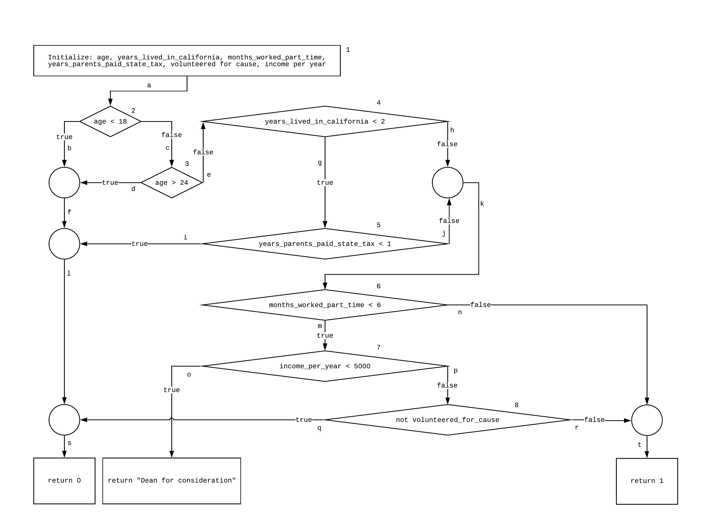

# Control Flow

## `student.py`

```python
"""
This module represents a student.
"""

__author__ = "Zelin Cai, Patrick Silvestre"
__version__ = "0.1.0"
__license__ = "MIT"


class Student:
    def __init__(self, age, years_lived_in_california, months_worked_part_time, years_parents_paid_state_tax,
                    volunteered_for_cause, income_per_year):
        self.age = age
        self.years_lived_in_california = years_lived_in_california
        self.months_worked_part_time = months_worked_part_time
        self.years_parents_paid_state_tax = years_parents_paid_state_tax
        self.volunteered_for_cause = volunteered_for_cause
        self.income_per_year = income_per_year

```

## `scholarship_eligibility.py`

```python
"""
This module determines the scholarship eligibility of a student.
"""

__author__ = "Zelin Cai, Patrick Silvestre"
__version__ = "0.1.0"
__license__ = "MIT"


def determine_eligibility(student):
    if student.age < 18 or student.age > 24:
        return 0
    if student.years_lived_in_california < 2:
        if student.years_parents_paid_state_tax < 1:
            return 0
    if student.months_worked_part_time < 6:
        if student.income_per_year < 5000:
            return "Dean for consideration"
        if not student.volunteered_for_cause:
            return 0

    return 1
```

## Control Flow Graph



## Statement Coverage Table

| Paths    |                              | Statements |     |     |     |     |     |     |     |     |     |     |     |     |     |     |     |     |     |     |     |
| -------- | ---------------------------- | ---------- | --- | --- | --- | --- | --- | --- | --- | --- | --- | --- | --- | --- | --- | --- | --- | --- | --- | --- | --- |
| Path No. | Path                         | a          | b   | c   | d   | e   | f   | g   | h   | i   | j   | k   | l   | m   | n   | o   | p   | q   | r   | s   | t   |
| 1        | a, b, f, l, s                | \*         | \*  |     |     |     | \*  |     |     |     |     |     | \*  |     |     |     |     |     |     | \*  |     |
| 2        | a, c, d, f, l, s             | \*         |     | \*  | \*  |     | \*  |     |     |     |     |     | \*  |     |     |     |     |     |     | \*  |     |
| 3        | a, c, e, g, i, l, s          | \*         |     | \*  |     | \*  |     | \*  |     | \*  |     |     | \*  |     |     |     |     |     |     | \*  |     |
| 4        | a, c, e, h, k, m, o          | \*         |     | \*  |     | \*  |     |     | \*  |     |     | \*  |     | \*  |     | \*  |     |     |     |     |     |
| 5        | a, c, e, g, j, k, m, p, q, s | \*         |     | \*  |     | \*  |     | \*  |     |     | \*  | \*  |     | \*  |     |     | \*  | \*  |     | \*  |     |
| 6        | a, c, e, h, k, m, p, r, t    | \*         |     | \*  |     | \*  |     |     | \*  |     |     | \*  |     | \*  |     |     | \*  |     | \*  |     | \*  |
| 7        | a, c, e, h, k, n, t          | \*         |     | \*  |     | \*  |     |     | \*  |     |     | \*  |     |     | \*  |     |     |     |     |     | \*  |

## Branch Coverage Table

| Paths    |                              | Branches |     |     |     |     |     |     |
| -------- | ---------------------------- | -------- | --- | --- | --- | --- | --- | --- |
| Path No. | Path                         | 2        | 3   | 4   | 5   | 6   | 7   | 8   |
| 1        | a, b, f, l, s                | T        |     |     |     |     |     |     |
| 2        | a, c, d, f, l, s             | F        | T   |     |     |     |     |     |
| 3        | a, c, e, g, i, l, s          | F        | F   | T   | T   |     |     |     |
| 4        | a, c, e, h, k, m, o          | F        | F   | F   |     | T   | T   |     |
| 5        | a, c, e, g, j, k, m, p, q, s | F        | F   | T   | F   | T   | F   | T   |
| 6        | a, c, e, h, k, m, p, r, t    | F        | F   | F   |     | T   | F   | F   |
| 7        | a, c, e, h, k, n, t          | F        | F   | F   |     | F   |     |     |

## Test Cases

To initialize a `student`, the following parameters are used:

- age
- years_lived_in_california
- months_worked_part_time
- years_parents_paid_state_tax
- volunteered_for_cause
- income_per_year

| Paths    |                              | Tests    |                          | Expected Output          | Actual Output            |
| -------- | ---------------------------- | -------- | ------------------------ | ------------------------ | ------------------------ |
| Path No. | Path                         | Test No. | Input Vector             |                          |                          |
| 1        | a, b, f, l, s                | 1        | <17, 0, 0, 0, 0, 0>      | 0                        | 0                        |
| 2        | a, c, d, f, l, s             | 2        | <25, 0, 0, 0, 0, 0>      | 0                        | 0                        |
| 3        | a, c, e, g, i, l, s          | 3        | <20, 1, 0, 0, 0, 0>      | 0                        | 0                        |
| 4        | a, c, e, h, k, m, o          | 4        | <22, 3, 4, 0, 0, 1000>   | "Dean for consideration" | "Dean for consideration" |
| 5        | a, c, e, g, j, k, m, p, q, s | 5        | <21, 0, 2, 5, 0, 10000>  | 0                        | 0                        |
| 6        | a, c, e, h, k, m, p, r, t    | 6        | <19, 10, 5, 2, 1, 15000> | 1                        | 1                        |
| 7        | a, c, e, h, k, n, t          | 7        | <24, 12, 40, 0, 0, 0>    | 1                        | 1                        |

## `test_scholarship_eligibility.py`

```python
"""
This module runs tests on students in regards to scholarship eligibility.
"""

__author__ = "Zelin Cai, Patrick Silvestre"
__version__ = "0.1.0"
__license__ = "MIT"

import unittest
import student as student_class
import scholarship_eligibility


class TestValidStudents(unittest.TestCase):
    """These tests focus on students who are eligible for scholarships."""

    """Test case: a, c, e, h, k, m, p, r, t"""

    def test_case6(self):
        student = student_class.Student(19, 10, 5, 2, 1, 15000)
        expected_output = 1
        actual_output = scholarship_eligibility.determine_eligibility(student)
        self.assertEqual(expected_output, actual_output)

    """Test case: a, c, e, h, k, n, t"""

    def test_case7(self):
        student = student_class.Student(24, 12, 40, 0, 0, 0)
        expected_output = 1
        actual_output = scholarship_eligibility.determine_eligibility(student)
        self.assertEqual(expected_output, actual_output)


class TestInvalidStudents(unittest.TestCase):
    """These tests focus on students who are not eligible for scholarships."""

    """Test case: a, b, f, l, s"""

    def test_case1(self):
        student = student_class.Student(17, 0, 0, 0, 0, 0)
        expected_output = 0
        actual_output = scholarship_eligibility.determine_eligibility(student)
        self.assertEqual(expected_output, actual_output)

    """Test case: a, c, d, f, l, s"""

    def test_case2(self):
        student = student_class.Student(25, 0, 0, 0, 0, 0)
        expected_output = 0
        actual_output = scholarship_eligibility.determine_eligibility(student)
        self.assertEqual(expected_output, actual_output)

    """Test case: a, c, e, g, i, l, s"""

    def test_case3(self):
        student = student_class.Student(20, 1, 0, 0, 0, 0)
        expected_output = 0
        actual_output = scholarship_eligibility.determine_eligibility(student)
        self.assertEqual(expected_output, actual_output)

    """Test case: a, c, e, g, j, k, m, p, q, s"""

    def test_case5(self):
        student = student_class.Student(21, 0, 2, 5, 0, 10000)
        expected_output = 0
        actual_output = scholarship_eligibility.determine_eligibility(student)
        self.assertEqual(expected_output, actual_output)


class TestRedirectedStudents(unittest.TestCase):
    """These tests focus on students who are to be redirected to the dean."""

    """Test case: a, c, e, h, k, m, o"""

    def test_case4(self):
        student = student_class.Student(22, 3, 4, 0, 0, 1000)
        expected_output = "Dean for consideration"
        actual_output = scholarship_eligibility.determine_eligibility(student)
        self.assertEqual(expected_output, actual_output)


if __name__ == '__main__':
    unittest.main()

```
